# Bot Forge

> **Официальный гайд:** [pochito.gitbook.io/bot-forge](https://pochito.gitbook.io/bot-forge/ustanovka-paneli/sait) · [botforge.farm](https://botforge.farm/)

---

# Гайд знакомство с панелью

Добро пожаловать, мы рады презентовать вам нашу панель. В данной документации вы найдете все функции на которые способна наша панель. Гайд будет дополняться, по мере добавления новых фич. Не важно, зашли вы сюда потому что у вас проблема, или же вы просто любознательный человек который любит почитать о продукте, желаю вам приятно провести время. \
Так же создали для пользователей панели [**чат**](https://t.me/chat_botforge), будем рады вас там видеть :)\
С любовью команда BotForge

# Сайт

> Наблюдая за многими панелями, нас не устраивало что все происходит через телеграмм.

Мы решили сразу делать все по цивильному, и поэтому сделали полноценный сайт. 

<a href="https://botforge.farm/">https://botforge.farm/</a>

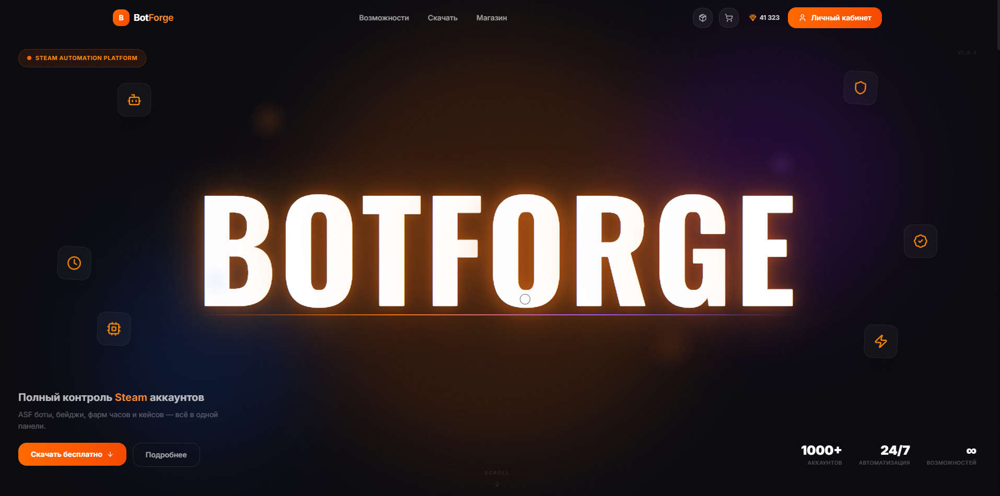

Интерфейс и функционал понятен. Регистрация возможна как на сайте, так и внутри панели. \
\
\
На сайте так же присутствует магазин, он такой же как и в нашей панели(разберем в будущем)

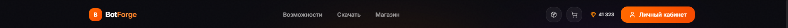

# Прогрев

> Рассмотрим нашу первую сторону. 

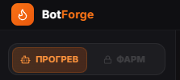

С ней вы столкнетесь как только авторизуетесь в панели, первая сторона панели предполагает в себя все взаимодействия со стимом. \ 

# Дашборд

> Первое что вас будет встречать при запуске панели, это наш Дашборд. 

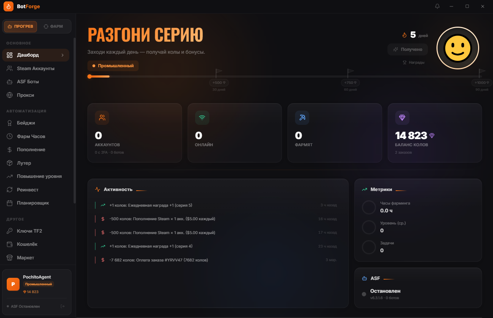

> В данной вкладке, вы можете увидеть вашу серию, мы решили раз наша панель заточена под фермеров, будет довольно уместно добавить некую серию, за которую можно будет получать нашу валюту. 

Ваша активность, указывает на взаимодействия с валютой. Ваши заказы, серия.
 
Метрики же указывают на то сколько задач помогла вам решить панель, какие в среднем имеют ваши аккаунты уровни, ну и понятное дело сколько часов нафармилось на ваших аккаунтах. 

# Steam Аккаунты

> Данная вкладка встретит вас именно так. 

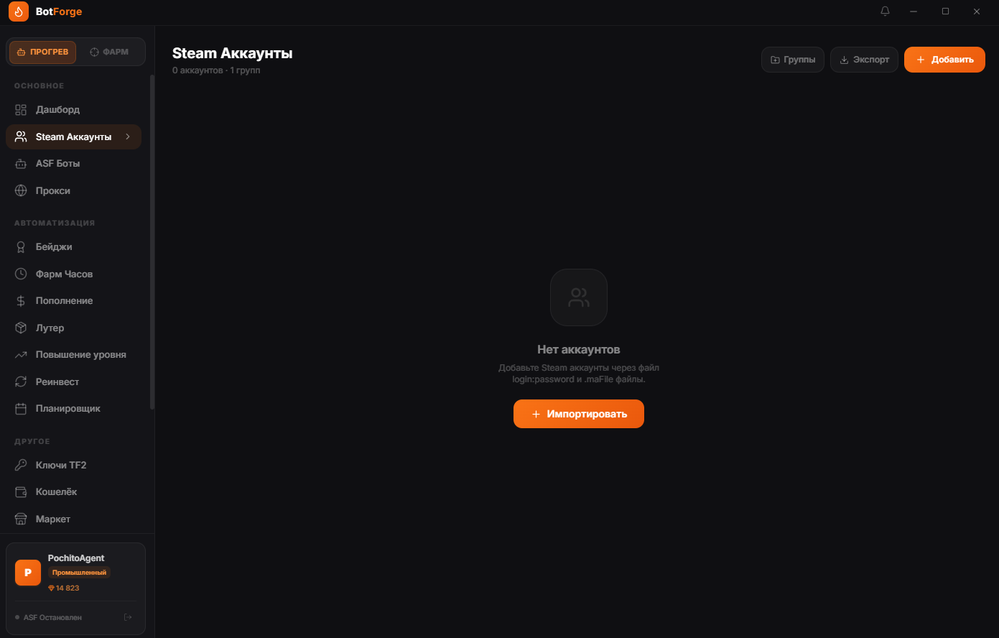

> Для добавление аккаунта вам понадобится текстовой файл где будет лежать 
login:password
и так же вам нужен MaFile файл. 

ШАГ 1

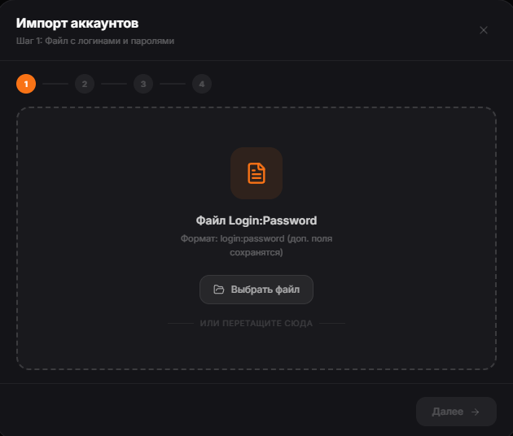

> Вы можете как выбрать текстовый файл, так и перенести его в указанное окно.

> ШАГ 2

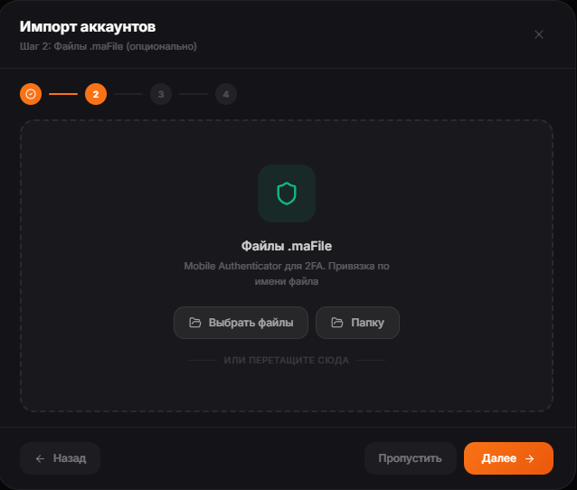

> Тоже самое, вы можете как выбрать файлы, так и выбрать папку где у вас находятся MaFile.

Слегка расскажу кратко что такое MaFile. MaFile представляет собой файл в котором хранится информация по которой панель, или сда может отправить запрос и получить 2FA код. Вы получаете его с помощью SDA.

ШАГ 3

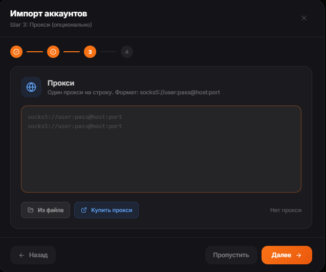

> Добавляем ваши прокси, лично мы пользуемся сервисом @node_proxy_bot 

После нажатие кнопки далее, у вас появится окно, где будут показаны логины ваших аккаунтов, их email адреса, а так же какой прокси подвязался именно к этому аккаунту.
Нажимаем кнопку импортировать.

Перед вами будет следующая картина

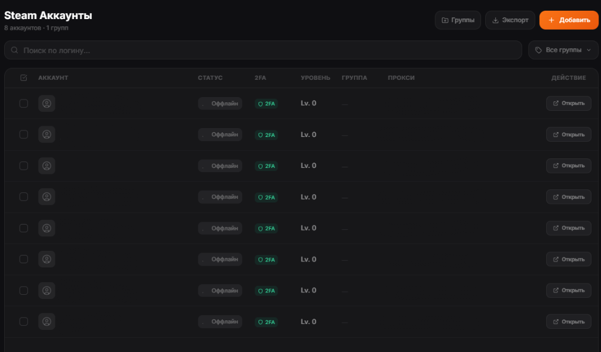

> Для того чтобы авторизоваться в ваш аккаунт в браузере, вы можете нажать кнопку <strong>Открыть</strong> справа

Если вам нужно распределить аккаунты по группам, вы должны в правом верхнем углу выбрать кнопку **Группы** после надо создать группу. \
\
После создание группы, вы выбираете нужные вам аккаунты, и в появившемся окошке, выбираете группа, а после и саму группу. \
\
Ваши аккаунты сохраняются для вашего аккаунта и становятся полностью зашифрованными, сделано это с целью того чтоб при создании новой ВМ вам не приходилось выполнять лишние действия по перебросу аккаунтов. Данная функция **отключаема в настройках**.

# ASF Боты

> ASF довольно хороший инструмент для работы с вашими аккаунтами, поэтому мы решили что будет крайне неплохо встроить в нашу панель автоматическое подключение ваших ботов. 

Все это делается в пару кликов, поэтому вам не надо даже разбираться не в каких гайдах как установить в ASF ваши аккаунты.  

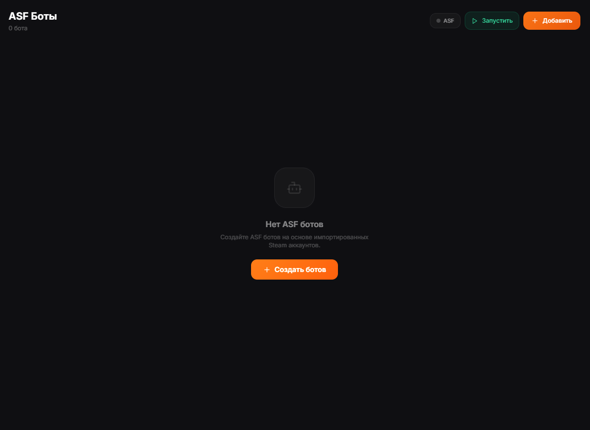

> Нажимаете кнопку создать ботов, выбираете все ваши аккаунты и жмете <strong>Создать</strong>
после запускаете справа сверху и наслаждаетесь. 
Выбираете аккаунт, нажимаете кнопку <strong>Действия</strong> и получаете популярные действия которые осуществимы через ASF но без разбирательств в командах.

# 3.1ㅤASF Боты | Действия

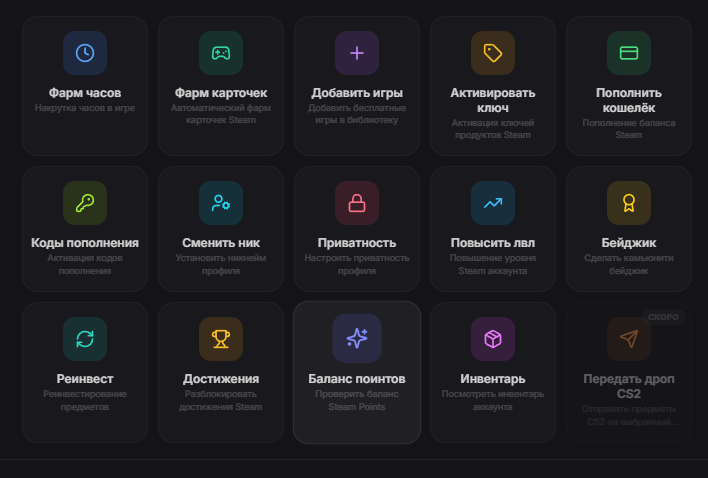

> <strong>Фарм часов</strong> - его функционал мы описывали в сегменте <strong>Автоматизация</strong> под вторым пунктом.

<strong>Фарм карточек</strong> - вы можете запустить фарм карточек для аккаунтов которые имеют возможность их фармить. Условия получение карточек - купить платную игру у которой есть карточки, поиграть в эту игру 2 часа. 

> <strong>Активировать ключ</strong> - если вам нужно активировать ключ, например купили гифт код игры, то это сюда.

> <strong>Пополнить кошелёк</strong> - перенесет вас на вкладку <strong>Пополнение</strong>.

> <strong>Коды пополнения</strong> - активировать коды <strong>пополнения</strong>.

> <strong>Сменить ник</strong> - название говорит само за себя.

> <strong>Приватность</strong> - позволяет выставить определенный настройки приватности, вы можете выбрать как только для друзей, так и полностью закрыть профиль. 

> <strong>Повысить лвл</strong> - перенесет вас на вкладку <strong>Повышение уровня.</strong>

> <strong>Бейджик</strong> - выполнение коммьюнити значка. перенесет вас на вкладку <strong>Бейджик.</strong>

> <strong>Реинвест</strong> - перенесет на вкладку <strong>Реинвест.</strong>

<strong>Достижения -</strong> вы можете выполнить достижения в играх

> <strong>Баланс поинтов</strong> - у стима есть своя валюта - steam points. За нее вы можете всякие косметические вещи, фон/аватарку/рамку.

> <strong>Инвентарь</strong> - переносит вас на вкладку <strong>Лутер</strong>.

# Прокси

> На этой вкладке вы можете добавлять свои прокси, так же назначать новым аккаунтам прокси.
Мы добавили кнопку того прокси которым пользуемся мы.
 

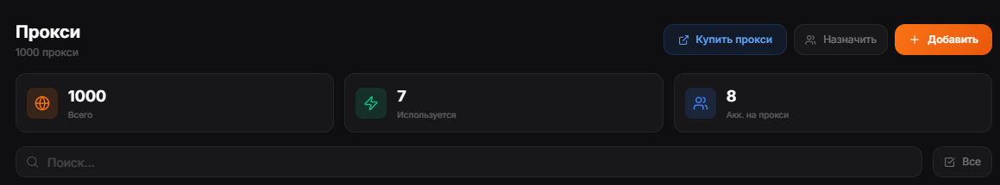

# 4.1ㅤNode Proxy

> Изначально, покупаете траффик. 5 гб вам хватит с головой. Они бесконечны, пока траффик не кончился.

> 

Как купили, заходим в настройки 

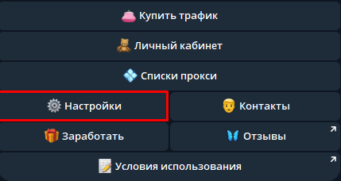

> Выбираем настройку экспорта прокси 

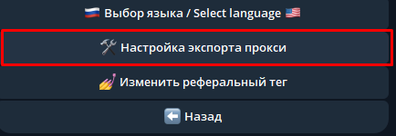

> Выставляем следующие настройки 

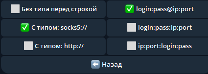

> Возвращаемся назад и выбираем "<strong>Создать список</strong>"

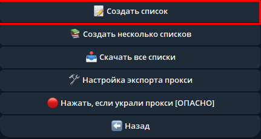

> Дальше вам говорят что делать, сначала идет нейм,потом страна прокси (я выбираю KZ), ротацию выбираю 0.

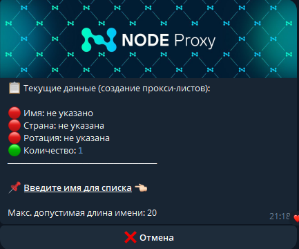

>  Дальше подтверждаете создание.

Как создалось, переходим в личный кабинет, списки прокси. 
Нажимаете на кнопку "Ваши списки" и выбираете тот нейм что вы указывали. 
У вас скачается текстовой файл с вашими прокси, его копируем и вставляем в панель :)

# Бейджи

> Данный функционал позволяет выполнять Community значок стима, с помощью которого выполняются все начальные действия, а так же получаете 2 лвл профиля. 

Перед началом, вы должны выбрать Master`а. 
Критерии Master аккаунта следующие 
Открытая торговая площадка, открытый профиль стим, загруженный скриншот в профиле, открытые комментарии под профилем. 

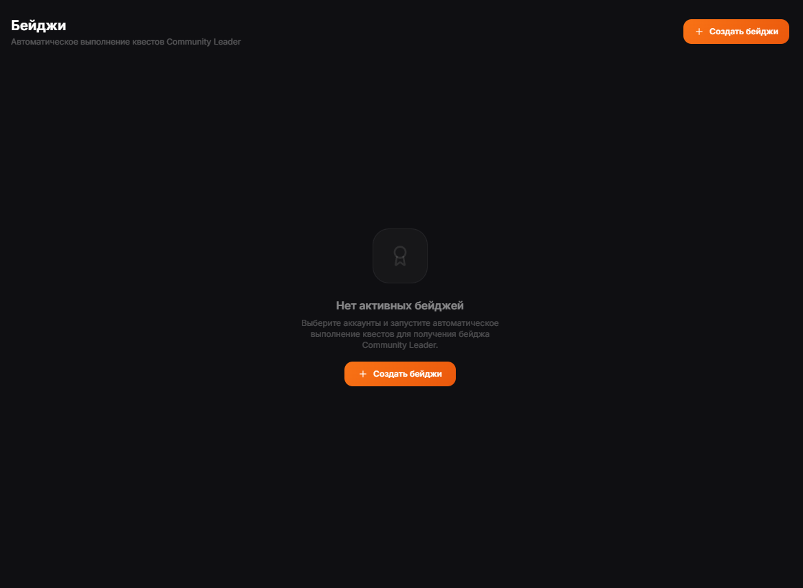

> Выбираете все аккаунты которым вы хотите выполнить значок и нажимаете кнопку <strong>Запустить</strong>

# Фарм часов

> При первом запуске этой вкладки вам предложат перейти на вкладку ASF боты и с помощью действия установить им фарм часов.

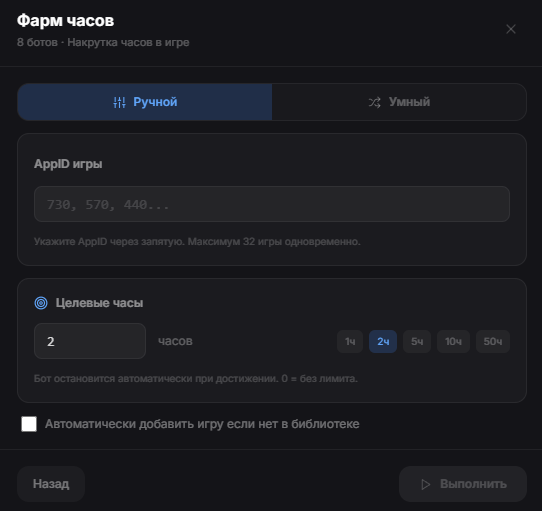

> Тут вы можете выбрать как ручной метод так и умный. 

Их различия в том, что ручной это вы устанавливаете игры которые вы хотите чтоб аккаунты играли, и сколько часов будут играть. 
В умном же все чуть сложнее в плане функционала, но намного проще для пользователя, так же создает видимость полностью живого человека. 

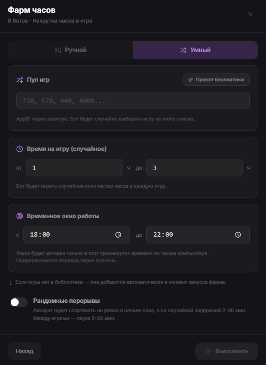

> Вы можете подтянуть по кнопке <strong>Пресет бесплатных</strong> множество популярных игр
установить интервал сколько примерно аккаунт будет играть в игру
так же можете установить интервал с какого по какое время он будет играть в игры. 

Так же очень рекомендуется поставить галочку на Рандомные перерывы, это неопределенность, что свойственно человеку.

# Пополнение ‼️

> Мы добавили прямое пополнение от нашего поставщика, здесь все автоматизировано, можете выбрать аккаунты которые вы хотите пополнить, и на сколько их пополнить.

!!!ВАЖНО!!! Если у вас пустой аккаунт, выставлен при регистрации определенный регион и  вы не хотите чтоб изменилась валюта в стиме - вы должны добавить одну бесплатную игру и отыграть в ней 3-4 часа. 
 
Аккаунты у которых валюта отличается от UAH,KZ,RU - не пополняются через эту вкладку, чтобы пополнить такие аккаунты воспользуйтесь вкладкой Маркет, и купите коды пополнения под ваш регион.

# Лутер

> Лутер нужен для того чтобы перебросить ваш инвентарь другому аккаунту. У нас все сделано посредством выбора Мастер аккаунта. Вы выбираете аккаунты с которых вы хотите перекинуть дроп, и выбираете мастер аккаунтом тот аккаунт который его примет. 

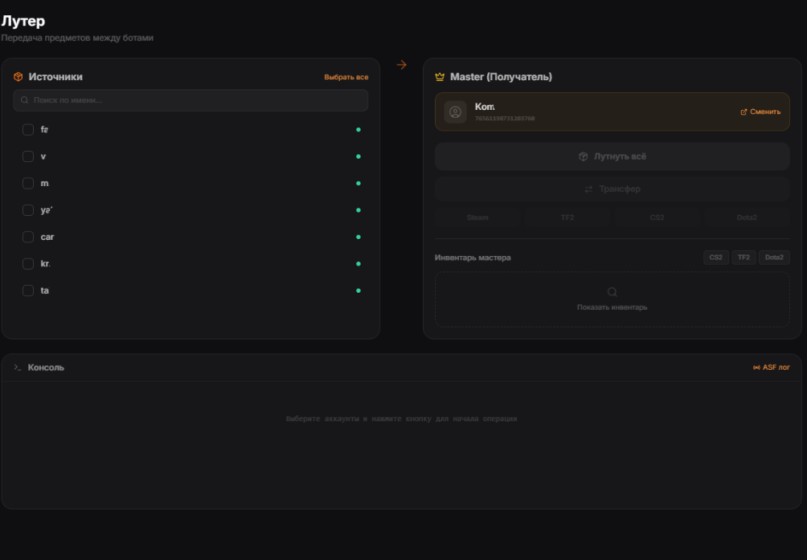

> Лутнуть все - заберет полностью все что можно с аккаунтов слева. 
Steam/TF2/CS2/Dota2 - забрать предметы с определенной игры
Так же вы можете нажать на окошко <strong>Показать инвентарь</strong> и вы получите информацию того что у вас есть в инвентаре, что трейдабельно или же нет. 

# Повышение уровня

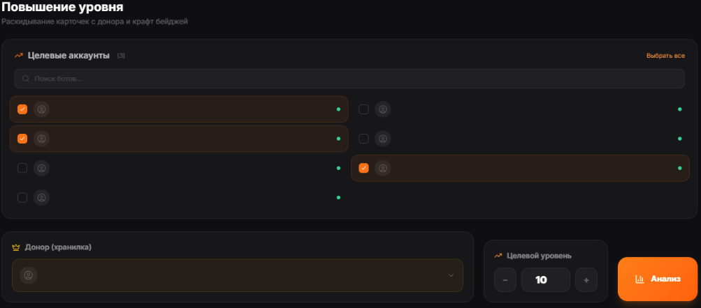

> Мы реализовали очень удобное повышение уровня. 
От вас требуется лишь хранилка с карточками, ее вставляете в донора, дальше выбираете до какого уровня хотите повысить уровни всех аккаунтов, и позже жмете анализ. Сама программа проанализирует сколько у вас наборов карточек на хранилке, и раскинет столько наборов сколько вам нужно для достижения целевого уровня. И крафт карточек произойдет само. 

# Реинвест

В данный момент эта вкладка в разработке. \
\
Суть данной вкладки - убрать из системы реинвеста присутствие хранилки, а с ее отсутствием у вас отсутствует шанс риска потерять дроп и вам не придется ждать дополнительное время. \
\
Сейчас система реинвеста строится так - вы отсылаете весь дроп на хранилку, ожидаете 8 дней, после отсылаете с хранилки по аккаунтам дроп - опять же ожидание 8 дней. \
\
Мы же решили реализовать парсер всех инвентарей наших ботов, произвести подсчеты, и раскидывать определенную сумму в качестве дропа с наших ботов, минуя хранилку. \
\
\ 

# Планировщик

Планировщик :)

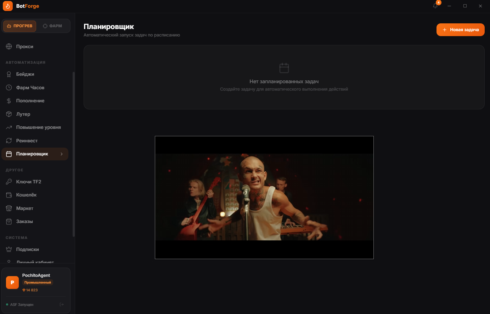

# Ключи TF2

Находится в разработке.

# Кошелёк

> Это ваш кошелёк, здесь вы можете пополнить баланс своих коллов, так же отследить историю своих транзакций. 

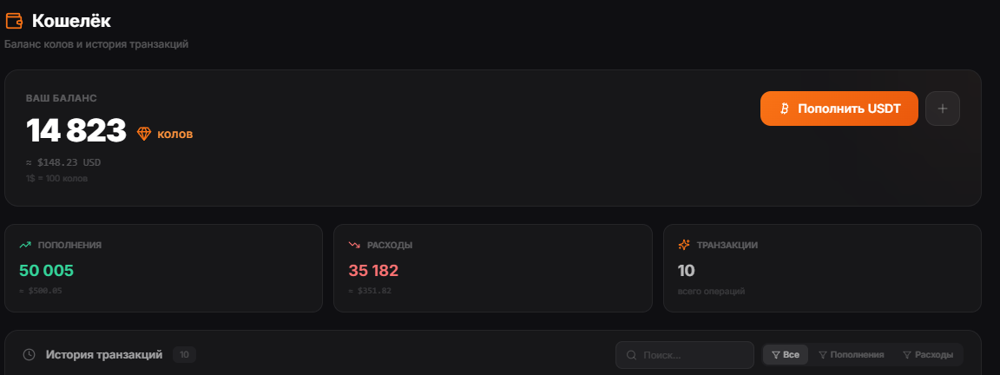

> Для того чтобы пополнить, вы нажимаете соответствующую кнопку и переводите либо по qr либо по адресу для перевода. После вставляете хэш и система сама отследит сколько долларов вы отправили, и начислит вам валюту. 

# Маркет

> Это наш магазин, здесь вы можете купить как прогретый аккаунт, авторег, так и коды пополнения. 

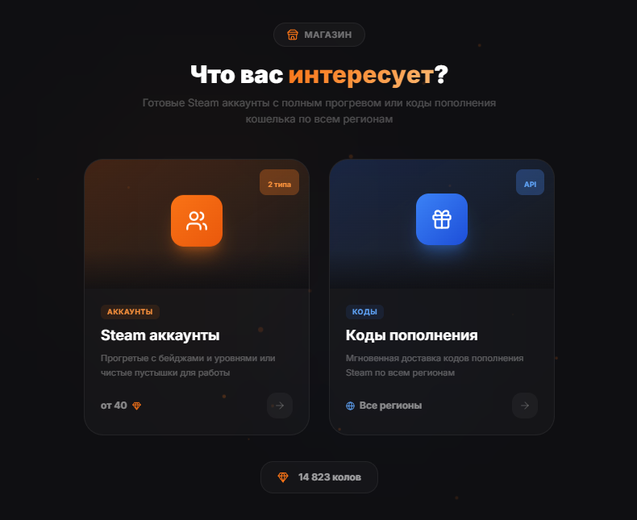

> Выбирая вкладку коды пополнения - у вас появляется следующее окно

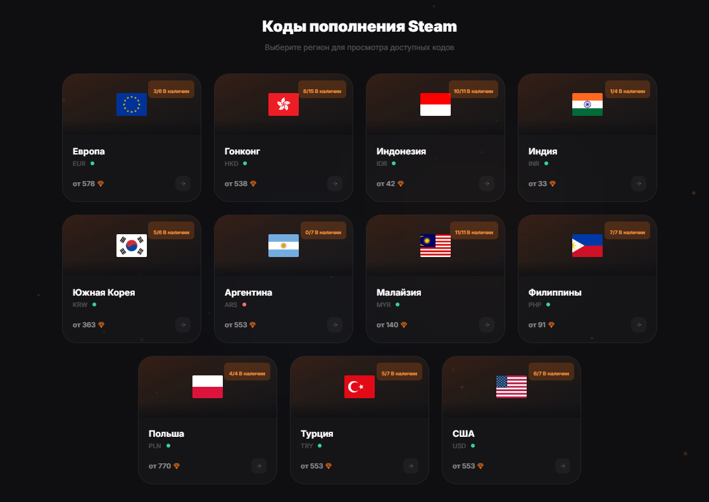

> Здесь указаны все популярные регионы, справа сверху на каждой карточке вы видите сколько номиналов валюты доступно. 

Выбирая определенный регион вы сталкиваетесь с такой менюшкой 

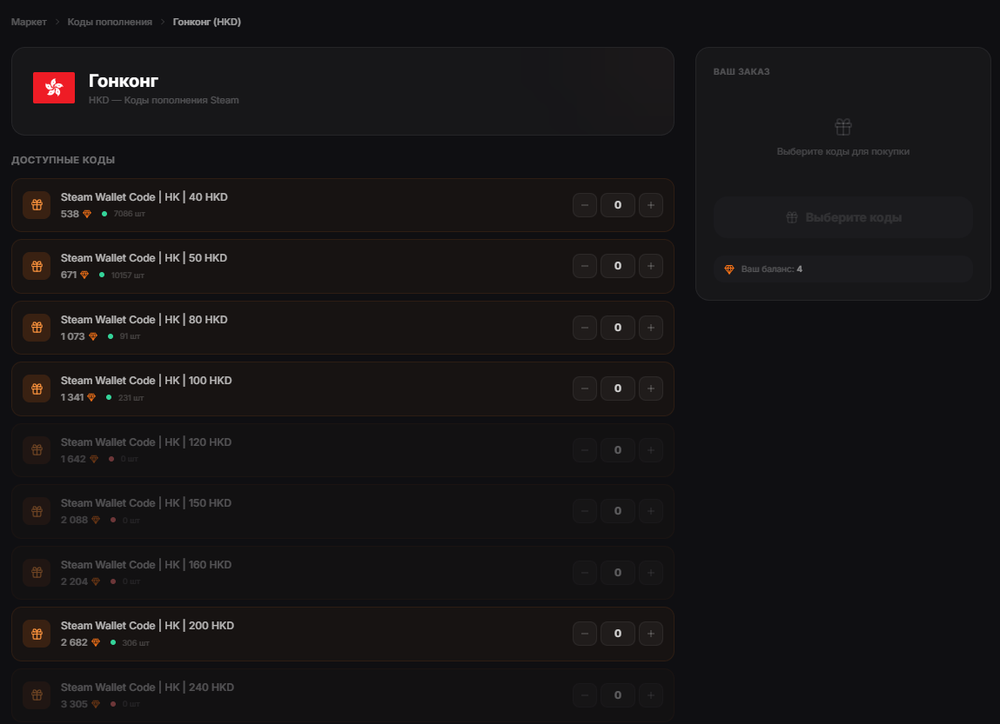

> Рассмотрим первый вариант, в нем вы видите что это валюта HKD(гонконгских долларов) а именно 40г.д. за 538 коллов, также вы видите сколько этих кодов сейчас в наличии а именно 7086 шт. 

На момент написания гайда 40 гонконгских долларов конвертируются в 5.12 долларов.
 

# Заказы

> Здесь будет находится все что вы купили, мы добавили крайне удобную систему, вы можете как скачать архивом, как просто скопировать, но самое удобное это автоматическое добавление аккаунта в вкладку Steam Аккаунты

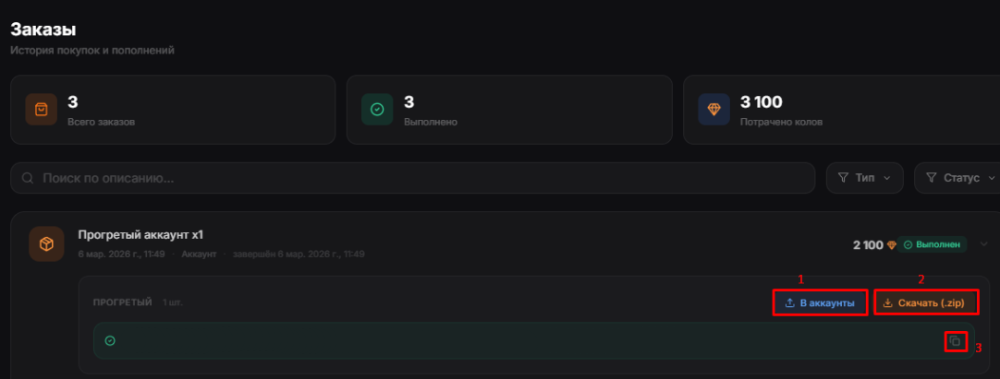

> 1 Как раз таки кнопка для переноса в вкладку Steam Аккаунты
2 Скачать архивом
3 Копирование данных  

# Подписки

> Думаю, вы должны сами оценить в панели как все это выглядит. 

# Личный кабинет

> Здесь вы можете узнать айди своего личного кабинета, какая у вас подписка и до какого срока, поменять пароль.

# Поддержка

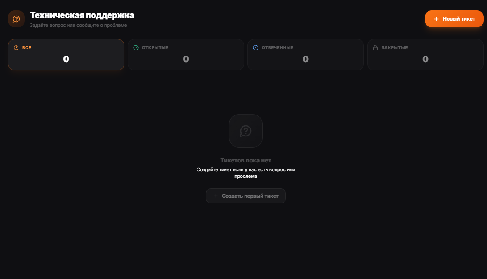

> В данной вкладке вы можете связаться с администрацией панели. 

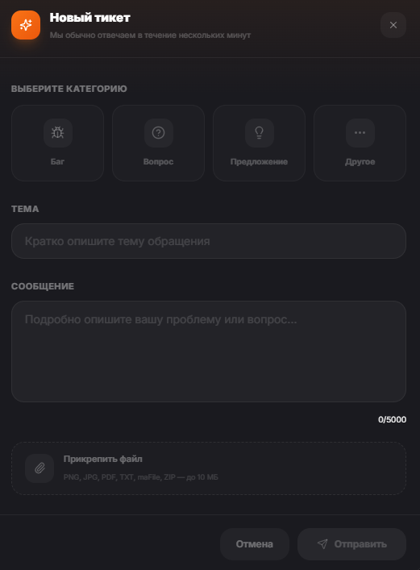

> 🔎🐞Если вы нашли какой либо баг в панели - сообщите используя тег "<strong>Баг</strong>", не важно сползающий это текст, или какой то супер уникальный случай. 
За каждый подтвержденный баг - мы начисляем вам 3 дня подписки(работает только для людей у которых подписка уже активна).

🤔❓Если у вас есть какой то вопрос насчет панели, и это никак не написано в путеводителе - задавайте вопрос используя тег "<strong>Вопрос</strong>". 
Если вопрос крайне интересный вы поспособствуете тому чтобы я дополнил наш путеводитель.

📋🔥У вас есть предложение? Обязательно напишите вашу идею используя тег "<strong>Предложения</strong>" 
Мы обязательно прочитаем ваше предложение и обдумаем. Если предложение стоящее естественно будет вознаграждение. 

Тег "<strong>Другое</strong>" существует для каких то других частных случаев. 

# Консоль ASF

> Это для разбирающихся людей, кому нужно изредка работать с ASF. 
Основные функции ASF мы и так либо автоматизировали либо сделали под них интерфейс, но частные случаи естественно останутся, для этого мы оставляем вам консоль. 

# 4.1 Покупка игры на аккаунте

> Если вам понадобилось купить игру на аккаунте вы можете воспользоваться консолью ASF. 

Перед вами откроется данное окно, в нем вы можете управлять аккаунтами с помощью команд. 

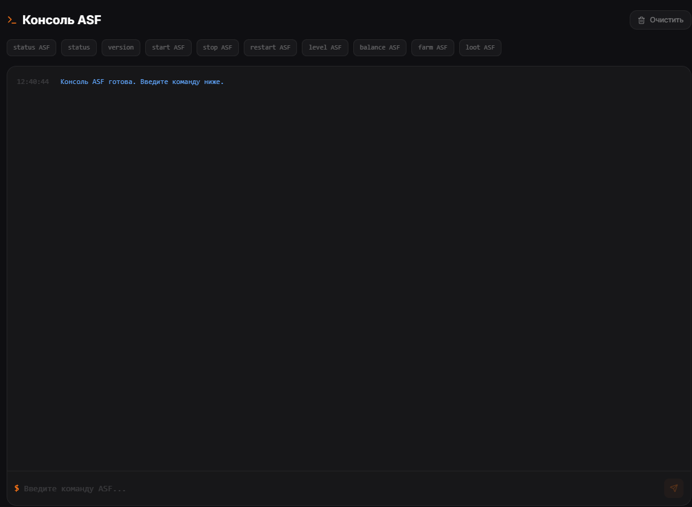

> Какая команда нас интересует для того чтобы купить определенную игру? - addcart&#x26;purchase

> addcart - команда для добавления определенной игры в корзину бота
purchase - команда для оплаты корзины используя баланс стима. 

> Предположим вы захотели купить UBERMOSH бандл, для отфарма карточек. Для начала вы должны узнать айди этой коллекции. 
Ищем нашу коллекцию в стиме. 

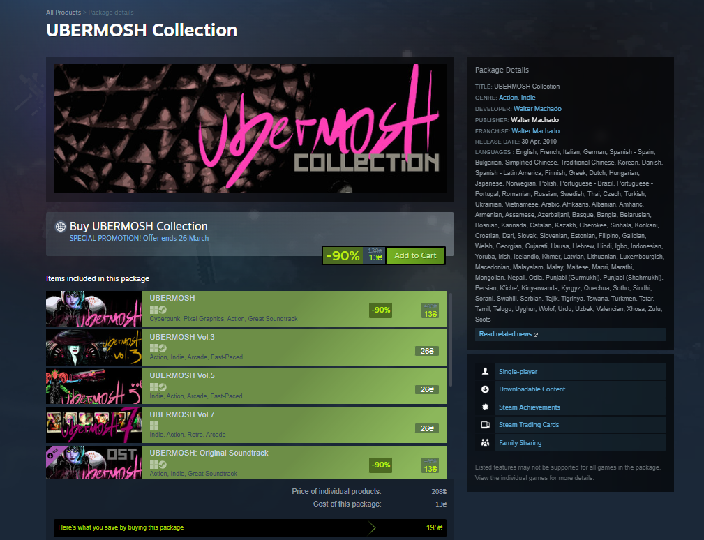

> Теперь нам важно узнать ее айди, это можно найти в ссылке. 

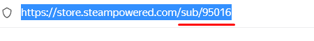

> Узнали? идем составлять нужную команду. Выглядеть она будет так : 

> <strong>addcart *LoginSteam* sub/95016</strong>

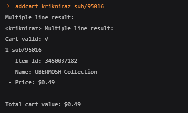

> А теперь, как ваша игра добавилась в корзину ее надо оплатить, для этого соотвественно поможет команда purchase.
<strong>purchase *LoginSteam*</strong>

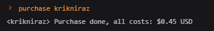

> 
Так же работает и с прайм статусом, он имеет следующее айди - <strong>sub/54029</strong>

> Примечание : Если вам нужно выполнить команду для всех аккаунтов то вместо логина аккаунта пишите ASF. т.е. purchase ASF.

# Настройки

> Сюда в основном вы будете заходить только по одной причине - обновить панель.

 

> Вы можете отключить облачную синхронизацию аккаунтов, ваши аккаунты будут только локально на вашем компьютере. 

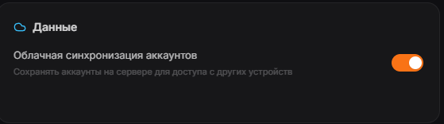

# Частые вопросы

**Не заходит в личный кабинет в панели**

Возможно вы вводите свою почту, надо именно логин. Так же попробуйте отключить ВПН или же наоборот его включить\ 

**Я купил аккаунты, но они не отображаются в панели**

Если вы купили на сайте аккаунты, они и будут храниться на сайте, в приложение они не попадают.

**Бейджики не выполняются**

Если у вас совсем не выполняются бейджики, и пишет ошибку Request timed out то скорее всего проблема в вашем впн, отключите его.

**При добавлении аккаунта на втором шаге пишет что не нашлись login:password**

Вы скорее всего не сохранили свой текстовой документ в котором лежит login:password

**Я купил игры, не фармятся карточки**

Зайдите во вкладку ASF боты и стопните ASF справа сверху, потом снова включите