# SDA

### Что такое SDA?

**Steam Desktop Authenticator (SDA)** — это программа, которая позволяет управлять двухфакторной аутентификацией (2FA) в Steam прямо с вашего компьютера. Она является альтернативой официальному мобильному приложению Steam и используется для генерации кодов аутентификации, необходимых для входа в аккаунт и подтверждения трейдов. SDA особенно полезен тем, кто часто торгует предметами или использует Steam на нескольких устройствах, поскольку он упрощает процесс авторизации и помогает избежать возможных задержек, связанных с использованием мобильного устройства. Кроме того, программа позволяет сохранять резервные коды.

### Как установить и запустить SDA?

* До начала прикрепления SDA вы должны открепить свой Steam аккаунт от Steam Guard.
* **Скачайте Steam Desktop Authenticator** с официального репозитория по ссылке: [GitHub - Jessecar96/SteamDesktopAuthenticator](https://github.com/Jessecar96/SteamDesktopAuthenticator).
  **Важно:** Скачивая программу с других источников, вы рискуете загрузить мошеннические программы. Используйте только рекомендованную ссылку.
* Нажмите на ссылку "Releases".

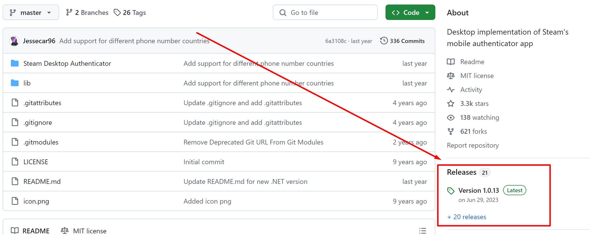

* Выберите самую последнюю версию (на момент написания статьи это 1.0.14) и откройте внизу поле Assets.

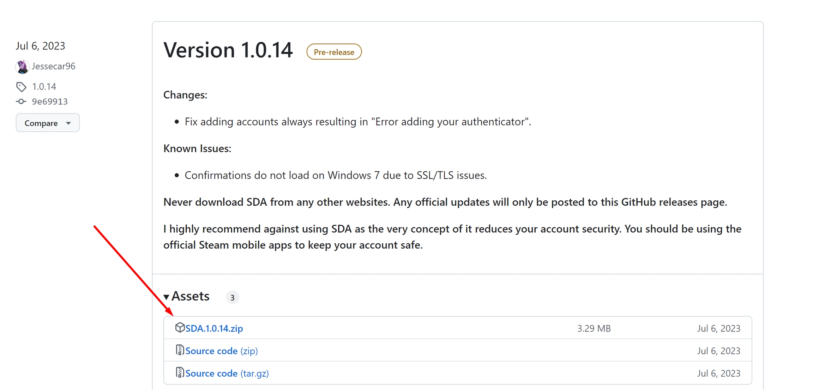

* Скачайте файл `SDA-1.0.14.zip`.
* После завершения загрузки откройте архив, распакуйте его, и дважды щелкните на `Steam Desktop Authenticator.exe`, чтобы запустить программу.

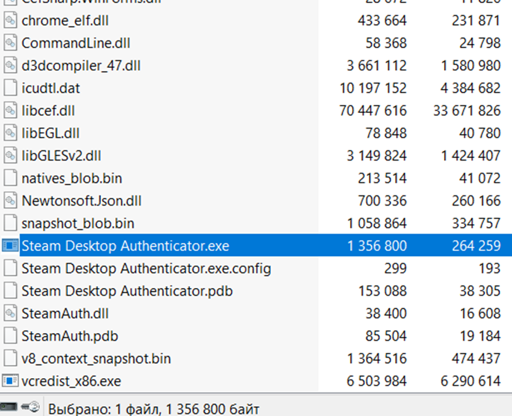

* В появившемся окне выберите опцию "This is my first time..." (если это ваш первый аккаунт).

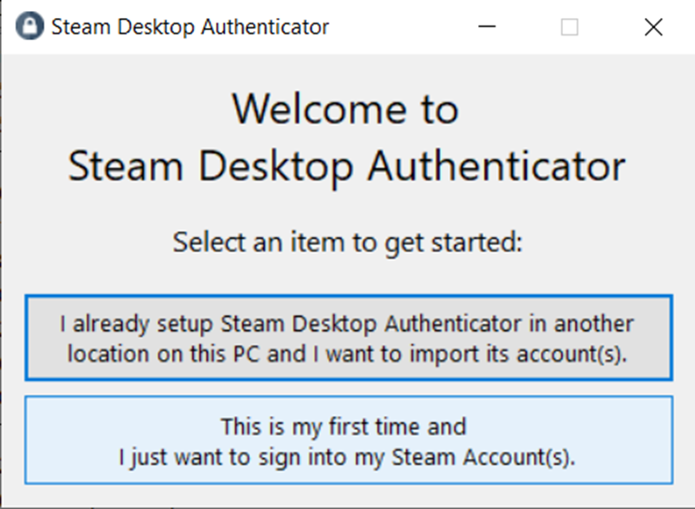

* Нажмите на кнопку "Setup new Account".

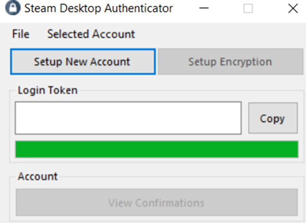

* Введите логин и пароль от вашего аккаунта Steam.

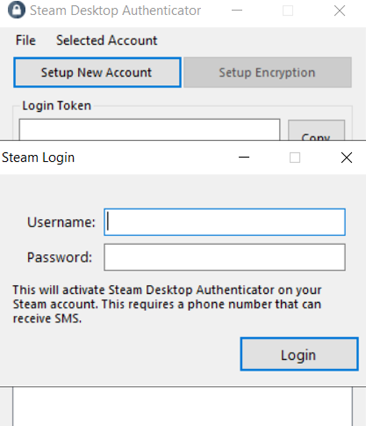

* Укажите адрес электронной почты, на который будет отправлен код подтверждения. Затем введите ваш номер телефона с международным кодом (в формате, указанном в окне).

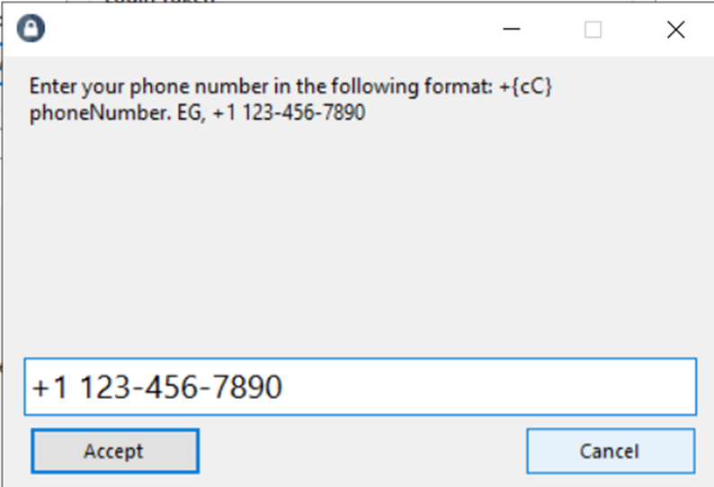

* После получения письма на почту, перейдите по ссылке в письме, чтобы подтвердить привязку номера телефона к аккаунту.

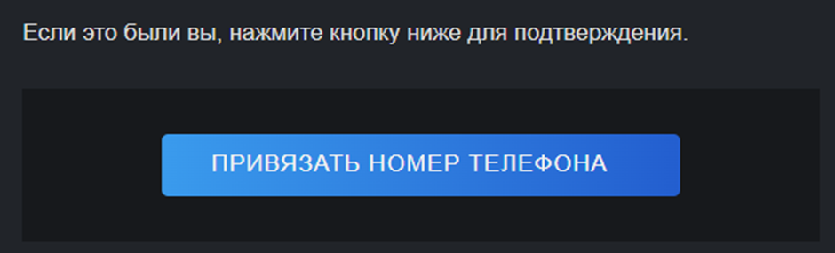

* Вернитесь в Steam Desktop Authenticator и нажмите "OK".

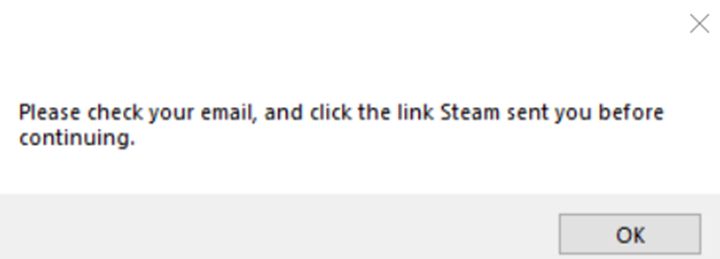

* Если вы планируете использовать Steam-бот, оставьте следующее поле пустым и нажмите "Accept".
  **Важно:** Отсутствие пароля в приложении необходимо для работы бота. В остальных случаях обязательно устанавливайте пароли и храните их в надежном месте.

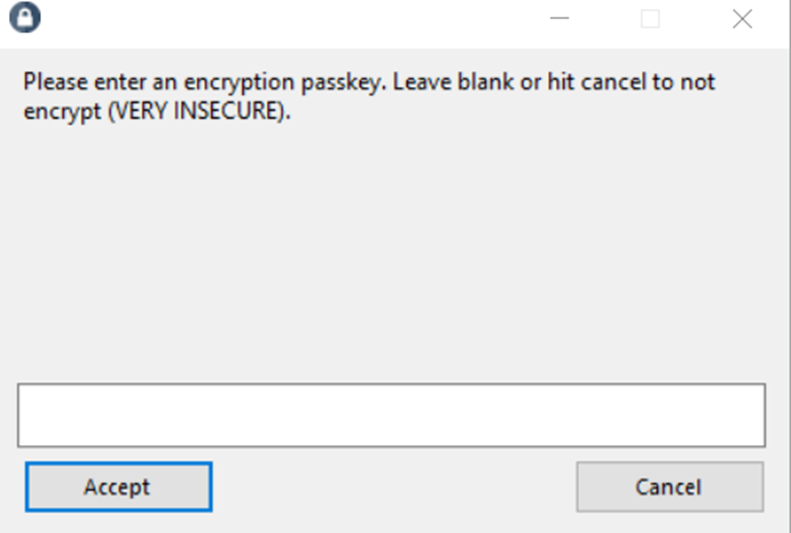

* Появится код в формате `R12345` — запишите его и нажмите "OK". Этот код понадобится для восстановления аккаунта.
* Введите код, полученный в SMS, и нажмите "Accept".

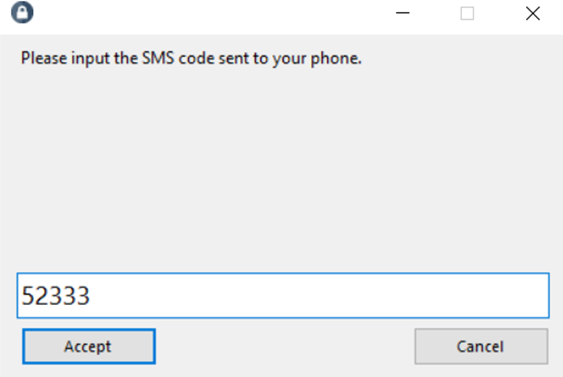

* В следующем окне снова введите код в формате `R12345` и нажмите "Accept".

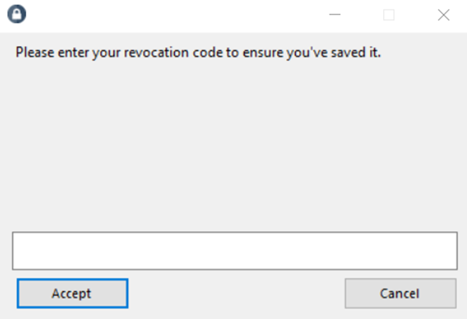

* Готово! Теперь перейдите в папку `maFiles`, которая находится в директории, куда вы распаковали архив.

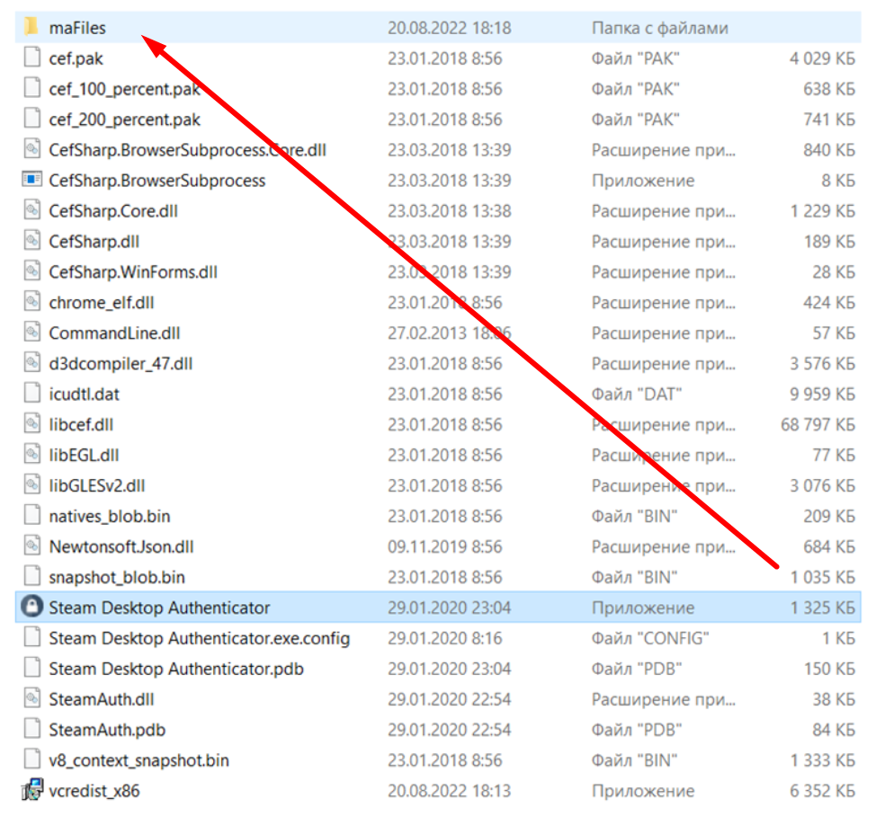

* В этой папке содержится информация, необходимая для работы бота. Откройте нужный файл как текстовый документ.
  **Важно:** Никогда не передавайте этот файл на другие ресурсы или сторонним ботам и храните его в надежном месте. Этот файл даёт доступ к вашему Steam аккаунту.
* Откройте файл блокнотом и найдите в файле поля "Shared_secret", "Identity_secret", и "SteamID". Скопируйте их значения и вставьте в соответствующие поля в боте, если вы хотите запустить Steam-бот.