# NebulaAuth

## **Что такое NebulaAuth?**

**NebulaAuth** — это приложение для эмуляции действий из мобильного приложения Steam. Которая заменяет ваш смартфон при работе в Steam.

У проекта открытый исходный код. До использования проверьте его на безопасность.

### Основные преимущества

* **Локализация на трёх языках**: английском, русском и украинском.
* **Полная функциональность Steam Desktop Authenticator**, переосмысление [старого приложения](https://github.com/Jessecar96/SteamDesktopAuthenticator)
* **Поддержка прокси** во всех процессах работы с аккаунтом.
* **Группировка мафайлов** для продвинутого контроля.
* **Автоматическое подтверждение трейдов/действий на ТП** для экономии времени.
* **Массовый импорт мафайлов** с помощью Drag'n'Drop или CTRL+V для удобства.
* **Настройка внешнего вида** для персонализации интерфейса.
* **Возможность подтвердить вход в учетную запись без ввода кода** для облегчения доступа.
* **Автообновление** программы для использования новейших функций.
* **Автоматический повторный вход в случае проблем с сессией** для непрерывной работы.
* **Интуитивно понятный интерфейс** с подсказками и удобствами
* **Постоянная поддержка** кода приложения и других функций.

## **Как установить и запустить NebulaAuth?**

1. Если приложение не запускается, необходимо установить [.NET Desktop Runtime](https://dotnet.microsoft.com/en-us/download/dotnet/8.0)
2. [Скачать программу из релизов этого репозитория на Github](https://github.com/achiez/NebulaAuth-Steam-Desktop-Authenticator-by-Achies/releases/latest)

   **Важно:** Скачивая программу с других источников, вы рискуете загрузить мошеннические программы. Используйте только рекомендованную ссылку.

* Нажмите на ссылку "Releases".

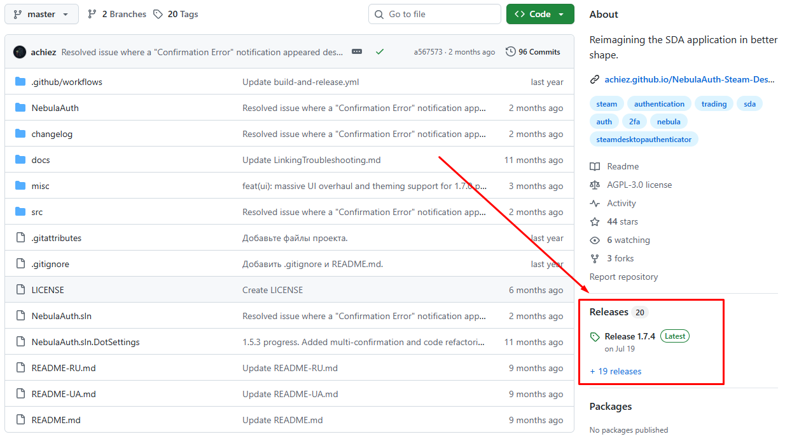

* Выберите самую последнюю версию (на момент написания статьи это 1.7.4) и откройте внизу поле Assets.

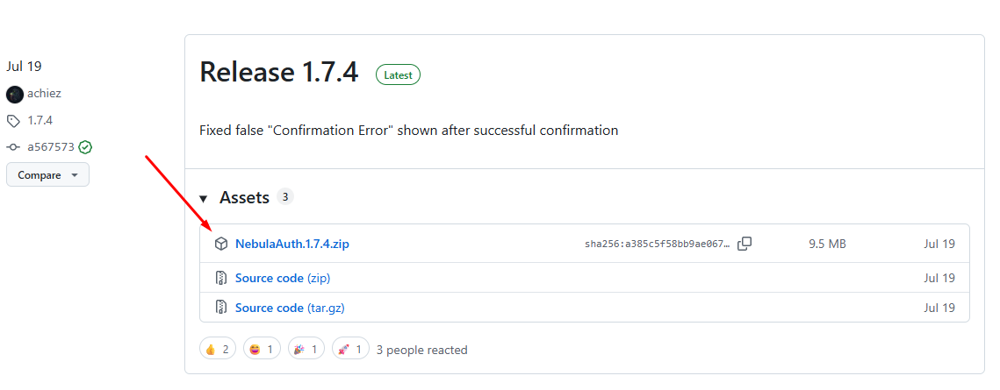

* Скачайте файл `NebulaAuth.1.7.4.zip`.
* После завершения загрузки откройте архив, распакуйте его, и дважды щелкните на , чтобы запустить `NebulaAuth.exe` программу.

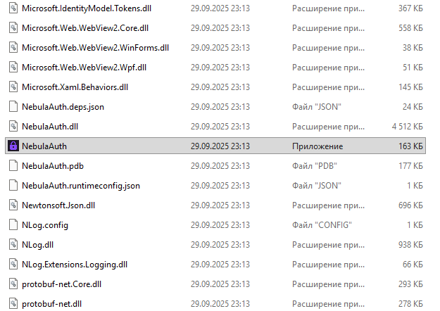

* Если приложение не запускается, необходимо установить .[NET Desktop Runtime](https://dotnet.microsoft.com/ru-ru/download/dotnet/thank-you/runtime-desktop-9.0.9-windows-x64-installer?cid=getdotnetcore)

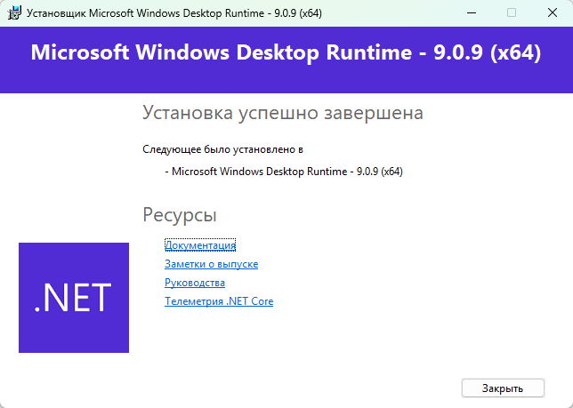

* Вас встречает окно программы, первым делом стоит выставить язык. File -> Settings, затем выбрать русский

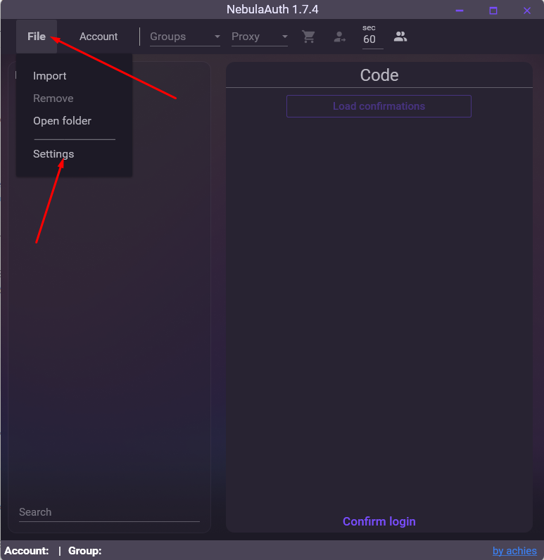

### Как добавить аккаунт Steam?

1. Привязать аккаунт на котором не подключен .mafile/Steam Guard
   .
2. Перенести аккаунт на которому подключен Steam Guard на мобильном устройстве.
3. Импортировать готовые мафайлы.

## Привязать аккаунт

1. Заходим в Аккаунт -> Привязать

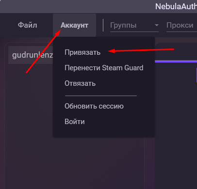

2. Вводим логин и пароль и продолжить

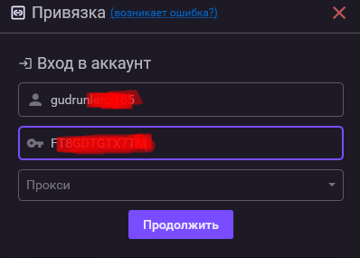

3. Далее попросит ввести номер телефона который привязан к аккаунту steam. На почту придет письмо с ссылкой. Его нужно открыть и затем в окне программы нажать продолжить

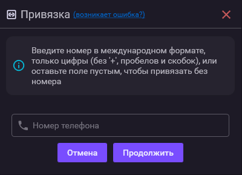

Второй вариант пропустить ввод номера и нажать продолжить. На почту придет код, который нужно ввести в поле Код и нажать Продолжить.

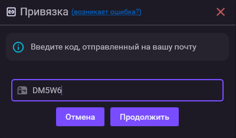

4. Появится код в формате `R12345` — запишите его и нажмите "Завершить". Этот код понадобится для восстановления аккаунта.

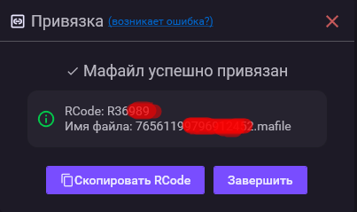

5. Готово! Теперь перейдите в папку `maFiles`, которая находится в директории, куда вы распаковали архив.

   

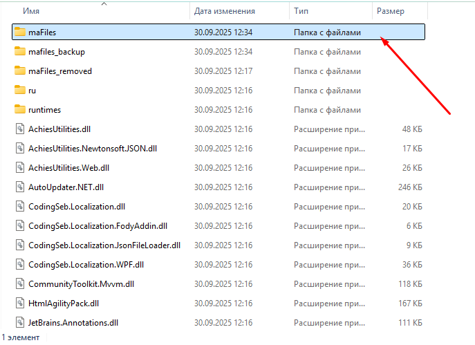

   * В этой папке содержится информация, необходимая для работы бота. Откройте нужный файл как текстовый документ. **Важно:** Никогда не передавайте этот файл на другие ресурсы или сторонним ботам и храните его в надежном месте. Этот файл даёт доступ к вашему Steam аккаунту.
   * Откройте файл блокнотом и найдите в файле поля "Shared_secret", "Identity_secret", и "SteamID". Скопируйте их значения и вставьте в соответствующие поля в боте, если вы хотите запустить Steam-бот.
6. Ваш аккаунт привязан, торговать на аккаунте можно будет через 7-15 дней после привязки. На скриншоте :
   1\) Ваш аккаунт Steam
   2\) Ваш аутентификатор Steam

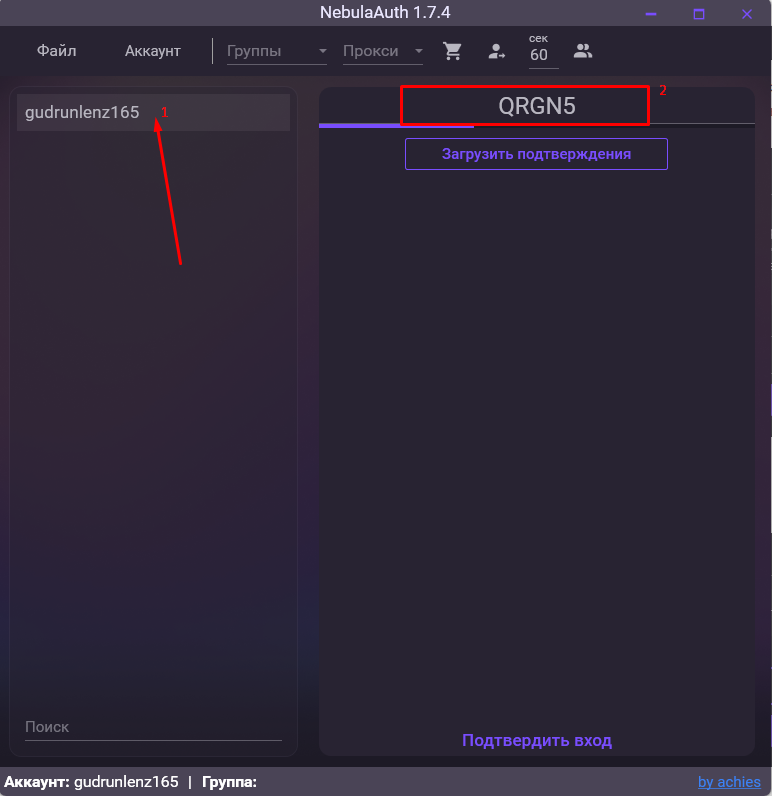

### Проблемы с которыми вы можете столкнуться

* Существует баг steam, когда при привязке без номера выдает ошибку что код с почты не подошел. Вверху программы есть ссылка на руководство решение этой проблемы

### Решение (важно следовать пунктам в точности)

1. После обнаружения ошибки необходимо **перезапустить процесс привязки** Steam Guard с самого начала.
2. Введите логин и пароль.
3. После этого появится запрос на ввод номера телефона. **Не игнорируйте** его и введите реальный номер
4. Нажмите на ссылку, которая придет к вам на почту.
5. Нажмите кнопку “Продолжить”.
6. Дальнейшее развитие событий может пойти по двумя сценариям: либо ошибка (неважно какая), либо запрос на ввод СМС.

   * Появилась ошибка (напр. “Не удалось подтвердить письмо с почты”, но может быть и другая) - переходим к шагу 7
   * Ошибка не появилась, мы перешли на этап ввода СМС (см. шаг 6.1)

   **6.1. Важно!** Не вводите СМС, если она пришла на ваш телефон. Закройте окно привязки.
   **6.2. Ждите 20 минут**, чтобы Steam “забыл” о номере телефона в процессе привязки.
7. На этом этапе проблема с аккаунтом должна исчезнуть.
8. Теперь можно повторить процесс привязки, как обычно. Проблема решена, и аккаунт можно привязать как с СМС, так и без неё.

Если инструкция не помогла, попробуйте ещё раз. Однако помните, что после 3-5 неудачных попыток Steam может заблокировать привязку на срок от 1 дня до недели. Чтобы избежать блокировки, рекомендуется сразу следовать данной инструкции при возникновении проблемы.

## Перенести аккаунт на которому подключен Steam Guard

Данный способ позволяет создать мафайл даже если уже активирован гуард на мобильном телефоне, без рут прав и даже на айфонах. Единственный нюанс данного способа - обмены и ТП будут недоступны 2 дня, но это все равно быстрее чем 15 при обычном удалении и создании.

### Что нужно для этого:

1. Установлено мобильное приложение Steam и активирован Steam Guard
2. К аккаунту привязан номер телефона и вы можете принять SMS
3. На телефоне уже разблокирован трейд — иначе будет применён стандартный холд до 15 дней

### Инструкция:

1. Откройте NebulaAuth и перейдите в Аккаунт → Перенести Steam Guard

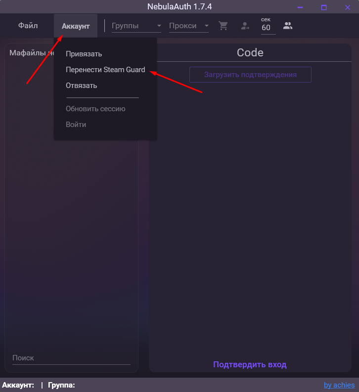

2. Введите логин и пароль от аккаунта и нажмите "Продолжить"

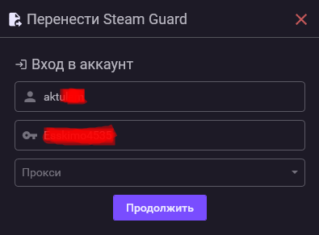

3. Подтвердите вход через мобильное приложение или введите код и нажмите "Продолжить"

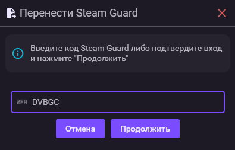

4. Далее введите SMS-код, полученный на привязанный номер

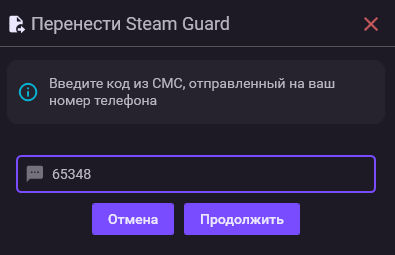

5. Появится код в формате `R12345` — запишите его и нажмите "Завершить". Этот код понадобится для восстановления аккаунта.

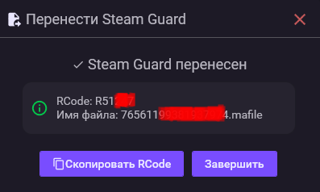

6. Готово! Теперь перейдите в папку `maFiles`, которая находится в директории, куда вы распаковали архив.

* В этой папке содержится информация, необходимая для работы бота. Откройте нужный файл как текстовый документ. **Важно:** Никогда не передавайте этот файл на другие ресурсы или сторонним ботам и храните его в надежном месте. Этот файл даёт доступ к вашему Steam аккаунту.
* Откройте файл блокнотом и найдите в файле поля "Shared_secret", "Identity_secret", и "SteamID". Скопируйте их значения и вставьте в соответствующие поля в боте, если вы хотите запустить Steam-бот.

**Этот способ — самый безопасный и удобный:**

* Не требует root-прав
* Подходит даже для iOS
* Позволяет сократить ожидание до 2-ух дней, вместо 15-ти

## Импорт мафайла

### Импортировать мафайлы можно тремя способами

1. Файл -> Импорт, затем выбор нужных мафайлов

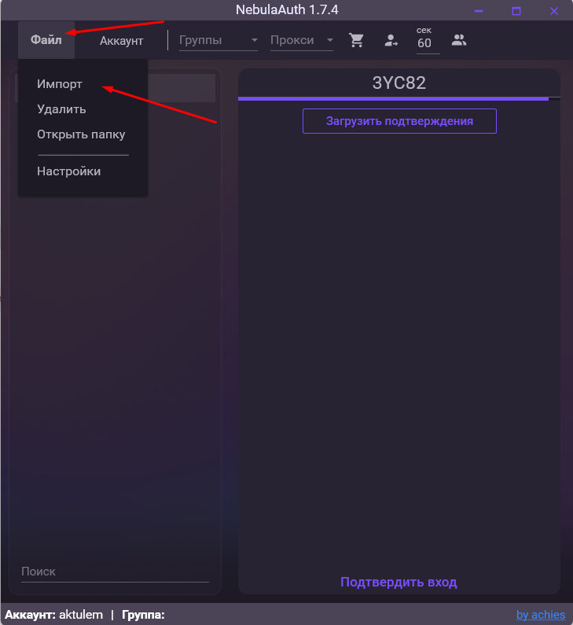

2. Перенести мафайлы на окно программы или нажать "Копировать" и CTRL+V в окне программы

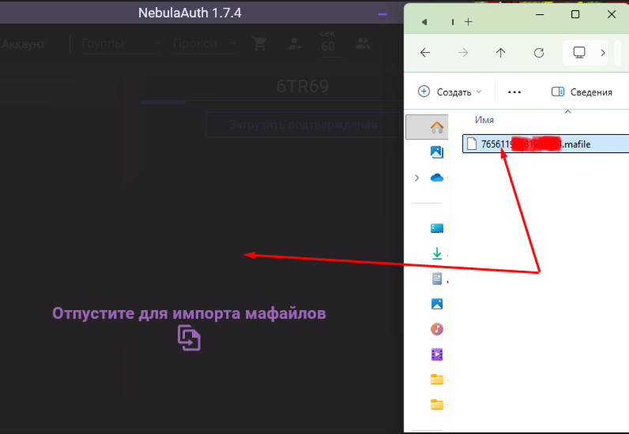

3. Перенести мафайлы в папку mafiles и затем перезапустить программу (лучше отдать предпочтение другим способам - 1 и 2)

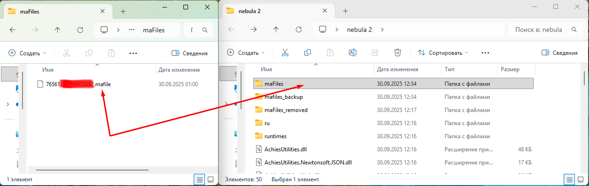

При импорте не просит ввод пароля, однако при импорте из других программ часто необходимо обновить сессию, т.к. формат сессии у Nebula уникальный.

Для этого надо нажать Аккаунт -> Войти и ввести пароль от аккаунта, это обновит сессию и аккаунт будет полностью импортирован. В будущем будет функция массовой установки паролей на аккаунты.

## Работа с прокси

Основная фишка NebulaAuth - возможность работать с прокси безопасно и без рисков пересечения аккаунтов по IP.
Все действия поддерживают прокси, включая привязку Guard, перенос Guard, подтверждения, авторизация

* Чтобы добавить прокси нужно нажать правой кнопкой мыши на поле "Прокси" в верхней панели

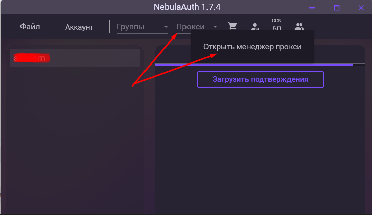

* Затем ввести прокси (можно несколько, каждый с новой строки) в форматах:
  
  ip:port:login:password
  
  protocol://ip:port:password
  
  ip:port

#### Пример: 123.123.123.123:4444:user:password

в конце прокси можно добавить какой ID будет назначен при добавлении (это лишь для удобства и по-желанию), для этого нужно добавить фигурные скобки с числом внутри. К примеру: 123.123.123.123:4444:user:password{444} добавить прокси и он будет с ID 444

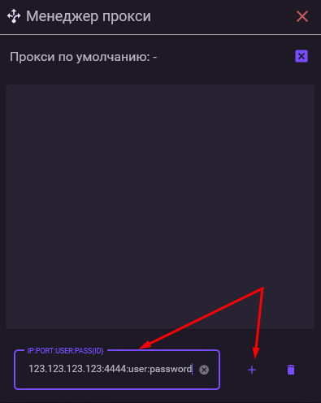

* Также на кнопку с сердечком можно назначить прокси по-умолчанию. Именно этот прокси будет использоваться если не выбран другой.

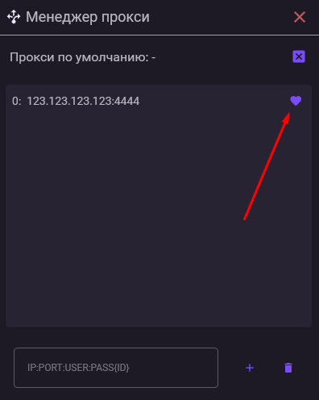

* После добавления прокси, обычно нужно выбрать этот прокси на аккаунт Сделать это очень просто:

1. Выбираем аккаунт слева
2. Выбираем нужны прокси в поле "Прокси"

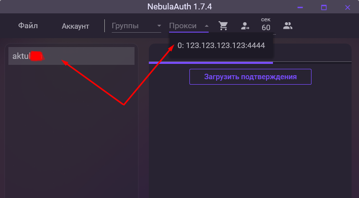

* Чтобы удалить прокси с аккаунта достаточно нажать на поле "Прокси" и нажать кнопку DEL на клавиатуре

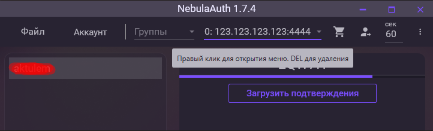